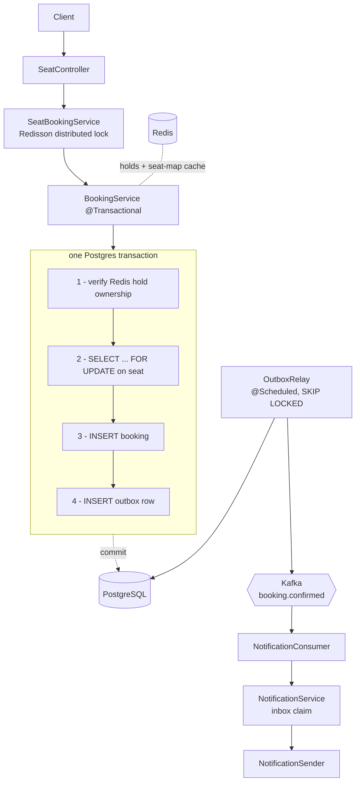

# Ticketly — a concurrent seat-booking API

**Java 21 · Spring Boot 4.1 · PostgreSQL · Redis · Kafka · Testcontainers**

> **One seat, one confirmed booking** — no matter how many people click *Book* at the same millisecond.

That single invariant is the spine of this project. Everything else here exists because holding it under real concurrency, across three datastores, turns out to be harder than it looks.

This is a deliberate learning build. Every mechanism was written the naive way first, **broken on purpose with a failing test**, and only then fixed. The tests that prove the bugs are still in the suite — they're the most useful thing in the repo.

---

## The problem

Two people book the last seat at the same time:

```
Thread A: SELECT ... WHERE seat_id = X   -> no booking found
Thread B: SELECT ... WHERE seat_id = X   -> no booking found
Thread A: INSERT booking                 -> ok
Thread B: INSERT booking                 -> ok, and now the seat is sold twice
```

Classic check-then-act. The gap between reading and writing is where the money goes missing. `BookingConcurrencyTest` fires **200 concurrent virtual threads** at a single seat and asserts exactly one row lands in the database.

---

## Architecture



The booking write and the "an event must be published" record commit **together, in one transaction**. Nothing is sent to Kafka from inside the request. A background relay drains the outbox afterwards.

---

## Correctness: three layers, three different jobs

A thing I got wrong early was assuming these were redundant. They aren't — they operate on different timescales and fail differently.

| Layer | Where | Lifetime | Job |
|---|---|---|---|
| **Seat hold** | Redis, `SET NX EX` | ~10 minutes | Business reservation. *Meant* to expire — an idle user should lose the seat. |
| **Distributed lock** | Redisson `RLock` + watchdog | milliseconds | Serialize writers on a hot seat. Sheds contention **before** a thread takes a connection. |
| **Partial unique index** | PostgreSQL | permanent | Hard correctness backstop. The only layer that cannot be bypassed. |

```sql
CREATE UNIQUE INDEX uq_booking_one_active_per_seat
       ON booking (seat_id)
       WHERE status <> 'CANCELLED';
```

**The honest version, which I think is the most interesting thing I learned here:** the distributed lock is *not* required for correctness. A `SELECT ... FOR UPDATE` row lock plus that unique index already coordinate every application instance — the database is itself a distributed lock. Redisson earns its place on **performance**: a transaction blocked on a row lock still owns its HikariCP connection, so 200 racers on one hot seat can starve unrelated browse traffic out of a 35-connection pool. Redisson makes the losers queue on Redis *before* they take a connection.

That also means the lock's theoretical unsafety (any lock built on a TTL can be held by two processes if one stalls past its lease) is acceptable — the unique index is the fencing token that makes it moot.

### Measured

`BookingConcurrencyTest`, 200 virtual threads, one seat, `CountDownLatch` start gate so they genuinely collide:

| Strategy | Successful | Clean 409 rejections | Constraint violations | Rows in DB |
|---|---|---|---|---|
| Naive check-then-act | 1 | 190 | **9** | 1 |
| Pessimistic row lock | 1 | 199 | **0** | 1 |

The invariant held in both cases — but only because the database refused the writes. In the naive version the application logic was wrong and the index was quietly cleaning up after it, wasting work and returning a confusing error class to ~5% of users. Correctness that lives *only* in a constraint is correctness you can't reason about.

A useful detail: the number of racers that got past the check tracked the **connection pool size**, not the thread count. The race window is bounded by how many threads can actually be in-flight in the database at once.

---

## Reliability: the dual-write problem

Once a booking commits in Postgres *and* an email has to go out via Kafka, there are two systems that can disagree. There is no ordering of two writes that is safe:

| Approach | Failure |
|---|---|
| Commit, then publish | Crash in between → booking exists, **nobody is ever notified** |
| Publish, then commit | Rollback after publish → **phantom event** for a booking that doesn't exist |
| Publish from an `AFTER_COMMIT` hook | Same as the first — plus a broker error surfaces as a **500 on a booking that succeeded** |

The escape is to refuse the premise: **one commit**.

### Transactional outbox

`BookingService` writes an `outbox` row inside the same transaction as the booking. `OutboxRelay` polls it on a schedule and publishes:

```sql
SELECT * FROM outbox WHERE published_at IS NULL
ORDER BY id LIMIT 100
FOR UPDATE SKIP LOCKED
```

`SKIP LOCKED` is what makes this safe to run on N application instances — each relay claims a disjoint batch instead of every instance racing to publish the same rows. `ORDER BY id` preserves per-key ordering. `published_at` being nullable is the whole state machine: it's the only thing in the system that distinguishes *owed* from *done*.

`eventSurvivesBrokerOutageAndPublishesOnRecovery` proves it end to end — the broker is sabotaged, the booking commits anyway, the row sits unpublished, and the scheduled relay drains it once the broker recovers. No request thread is alive by then.

### At-least-once in, exactly-once effect out

The outbox converts the problem rather than eliminating it. If the relay dies *after* the broker acknowledges but *before* `published_at` commits, the next tick republishes. That window is real and `republishesEventWhenRelayCrashesAfterBrokerAck` reproduces it deterministically — by rolling back the relay's transaction, which is exactly what a crash looks like from the database's point of view.

So duplicates are **normal**, and the consumer absorbs them with an inbox:

```sql
INSERT INTO inbox (consumer_group, message_id, processed_at)
VALUES (?, ?, ?)
ON CONFLICT (consumer_group, message_id) DO NOTHING
```

Claim first, act second. The claim and the effect share one transaction, so the dedup mark can never survive a failed effect. The key is `(consumer_group, message_id)` — not `message_id` alone — because *"processed"* is a property of a message **and a handler**; a second consumer group has to be able to process the same message independently.

Worth being precise about what this does and doesn't give you: Kafka cannot offer exactly-once *delivery* into Postgres. What this achieves is **exactly-once effect on top of at-least-once delivery**. The message id is generated by the producer at event creation and travels inside the payload — a broker offset can't work, since a republished record gets a new one.

---

## Caching

Seat maps are read constantly and change rarely, so `SeatService` uses manual cache-aside against Redis (10-minute TTL). Invalidation is an `@TransactionalEventListener(AFTER_COMMIT)` that evicts the key.

Two details that turned out to matter:

- **Evicting before commit is a bug.** A concurrent reader repopulates the cache from pre-commit state and the stale entry then survives its full TTL.
- **Cache DTOs, never entities.** A serialized entity drags lazy proxies and object graphs with it. `ValidSeatMapTest` was written red first — it caught a genuinely stale seat map before the eviction listener existed.

`AFTER_COMMIT` is safe here for a reason worth naming: **it's safe exactly when the work it does is recoverable by other means.** A missed cache eviction is repaired by the TTL, and the database stays authoritative. A missed Kafka publish has no such fallback — which is precisely why publishing had to move to the outbox.

---

## Testing

Everything runs against **real PostgreSQL, Redis and Kafka via Testcontainers** — no mocks for infrastructure, no H2. `@ServiceConnection` wires the containers into Spring Boot automatically.

**10 test classes / 13 tests**, and the ones worth reading:

| Test | What it proves |
|---|---|
| `BookingConcurrencyTest` | 200 concurrent threads, one seat, one row |
| `SeatHoldTest` | Only one user can acquire a hold |
| `SeatHoldNotReleasedOnRejectTest` | A rejected booking doesn't release someone else's hold |
| `ValidSeatMapTest` | Cache eviction actually happens on booking |
| `BookingConfirmedPublishingTest` | Publishing works; the event survives a broker outage; a relay crash republishes |
| `ExactlyOnceEffectTest` | The same message delivered twice produces **one** side effect |

The rule I follow: **every test gets deliberately broken once to confirm it fails for the right reason, at the right line.** A green test only means what it actually checks — I've shipped tests that passed while asserting nothing, and that's how I found out.

```bash
./mvnw test
```

---

## Running it

Requires Docker and JDK 21.

```bash
./mvnw spring-boot:run     # Spring Boot Docker Compose starts Postgres, Redis and Kafka
```

Flyway owns the schema (`ddl-auto=validate` — Hibernate is never allowed to generate DDL).

A full walkthrough:

```bash
# create an event
curl -X POST localhost:8080/events -H 'Content-Type: application/json' \
  -d '{"name":"WC Final","venue":"Ortalyq Stadium","startsAt":"2026-08-19T13:55:00Z"}'

# add a seat
curl -X POST localhost:8080/seats -H 'Content-Type: application/json' \
  -d '{"eventId":"<event-id>","label":"vip-1"}'

# hold it, then book it
curl -X POST localhost:8080/seats/<seat-id>/hold     -H 'Content-Type: application/json' -d '{"userId":"user-1"}'
curl -X POST localhost:8080/seats/<seat-id>/bookings -H 'Content-Type: application/json' -d '{"userId":"user-1"}'
```

Booking without a hold returns `409`. Booking a seat someone else holds returns `409`. The notification arrives asynchronously through Kafka.

### API

| Method | Path | Notes |
|---|---|---|
| `GET` | `/events` | List events |
| `POST` | `/events` | Create an event |
| `GET` | `/events/{eventId}/seats` | Seat map with availability (cached) |
| `POST` | `/seats` | Add a seat to an event |
| `POST` | `/seats/{seatId}/hold` | Acquire a 10-minute hold |
| `POST` | `/seats/{seatId}/bookings` | Confirm a booking against your hold |

Errors map to status codes through a `@RestControllerAdvice`: unknown seat/event → `404`, seat already booked / held by someone else / not held → `409`, lock acquisition timeout → `503`.

---

## Schema

Owned by Flyway, six migrations.

| Table | Purpose |
|---|---|
| `event`, `seat` | Catalogue. `UNIQUE (event_id, label)`. |
| `booking` | Partial unique index enforcing one non-cancelled booking per seat. |
| `outbox` | `published_at IS NULL` = owed. Partial index on unpublished rows only. |
| `inbox` | `UNIQUE (consumer_group, message_id)` — consumer-side dedup. |

`V2`/`V3` are an artifact of an experiment: I added `@Version` optimistic locking, discovered it fired **zero** times because the unique index catches racers first (Hibernate flushes the `INSERT` before the version `UPDATE`), dropped the index to watch it work in isolation, then restored it. `@Version` guards *lost updates* on an existing row; a booking is an *insert* race, and for that the unique constraint **is** the optimistic mechanism.

---

## Design decisions

- **Package by feature, not by layer** — `booking`, `seat`, `hold`, `outbox`, `notification`. Boundaries you can enforce, and seams to extract a service along later.
- **Pessimistic over optimistic locking** for booking. Contention on a hot seat is the normal case, not the exception, and optimistic locking degrades into a retry storm exactly when it matters.
- **`bigserial` for outbox/inbox, UUID for domain entities.** The outbox is never exposed, so UUID's non-enumerability buys nothing, while the relay needs a monotonic `ORDER BY` and B-tree locality on an insert-heavy table.
- **Outbox payload stored as `text`, not `jsonb`.** The row's job is to freeze the exact bytes that were true at commit time; `jsonb` reparses and reorders keys.
- **Native SQL where the mechanism matters** (`SKIP LOCKED`, `ON CONFLICT`) rather than hiding it behind JPA annotations. The trade-off is real and I've paid it twice: native queries aren't validated at startup, so a typo survives until the query runs.
- **A Kafka topic is a public API.** `BookingConfirmedMessage` is a wire contract — adding a field is safe, renaming one is a multi-deploy migration, and the compiler will not warn you, because the coupling is over the wire rather than the classpath.

---

## Status & what's next

Working end to end; still being built. Known gaps, in the order I'm tackling them:

- **Dead letter topic + retry policy** — a poison message currently gets redelivered by the default error handler instead of being parked. Also multi-partition consumer-group behaviour under rebalance.
- **Authentication (Spring Security).** This is the significant one and I'd rather name it than hide it: `userId` is currently supplied by the client, so the API trusts the caller about who they are. Security is configured permit-all. Real authentication, `userId` taken from the `Authentication` rather than the request body, and role-checks on admin endpoints.
- **A real notification channel.** The consumer currently logs a fake email. Duplicates and timeouts only become real once something user-visible is on the other end.
- **Payment simulation** with injected failures → retries, timeouts, circuit breakers. This surfaces the hold-expires-during-slow-payment race, which needs compensation.
- **Load testing** (k6/Gatling) with p99 numbers and a zero-double-booking proof recorded here.
- **Observability** — Actuator is already on the classpath; Prometheus and Grafana next.

Things I'd like to get to after that: running the Testcontainers suite in GitHub Actions, a live deployment, and distributed tracing once the notification consumer becomes its own service.
